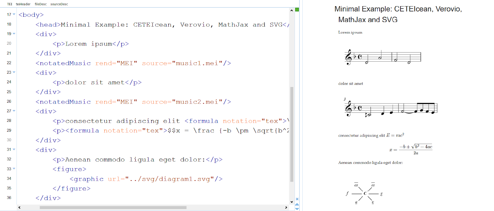

## 1 Scope and Appeal to the Community

The integration of text and music notation initially appears to be a topographical issue of text presentation. From a text encoding perspective, the problem can be addressed by integrating graphical representations of music notation as digital images. However, from a music encoding perspective, this approach is insufficient, as it prevents the formulation of relationships between text and music notation encoded in the data (cf. Roeder/Moss/Köster 2023). Therefore, the objective is to model and encode both text and music with comparable structural and semantic depth, and to host it within a long-term sustainable environment. While such a presentation could integrate scanned or vectorized music notation graphics alongside embedded MEI data, the preferred approach is to generate the presentation directly from the data without intermediate formats—while providing a fallback solution with embedded graphics only if necessary.
Instead, we propose to use two tools closely associated with TEI and MEI: Verovio for rendering music notation and CETEIcean, a lightweight tool for TEI processing. Both operate on JavaScript and require only a standard web server, as TEI and MEI are both processed client-side. Further, for the integration of mathematical formulas, MathJax is used to render LaTeX notation, while the native support of SVG in browsers is used to render diagrams (see Figure 1).

Figure 1. A minimal example rendering text, music notation, formulas (inline and block layout), and a diagram.

Due to the different encoding standards, it is necessary to decide how to organize text and music notation data at the file level. To avoid potential namespace conflicts between frameworks, and to allow for modular editing by experts in different encoding domains, separating them into distinct files has proven effective. Rather than producing multiple MEI files, data can be consolidated into a single file with cross-references to TEI sections. For example, a treatise with alternating text and musical examples could use a primary TEI file for the text and a single MEI file containing all musical excerpts, each tagged with unique IDs for cross-referencing. This approach reduces complexity while maintaining semantic depth as well as potential for multi-modal interlinking.
Depending on the chosen data organization, the rendering process must be arranged for the browser. With the selected combination of CETEIcean and Verovio, HTML and SVG code are generated live using JavaScript. This requires precise timing: a music notation section can only be rendered by Verovio once the corresponding HTML element has been generated by CETEIcean. To achieve this synchronization, the frameworks are orchestrated via monitoring: When CETEIcean processes an XML element referencing a musical excerpt, it temporarily hands over control to Verovio to render the notation dynamically. This interplay ensures a seamless user experience without relying on pre-generated images or static files.
A number of minimal examples is available at the GitHub repository of the Music SIG of the Text Encoding Initiative (cf. TEI Music SIG 2025), which is potentially to be extended by future multimodal use cases, such as non-Western music notations and audio and video for performance-based editions.
Finally, ensuring long-term sustainability is a central concern of digital edition projects. However, dynamic digital editions are often precarious resources, as they usually depend on complex server environments. Even standard solutions (e.g. with TEI Publisher) require regular maintenance, which projects and their institutions are not always able to guarantee in the long run. For rendering components such as CETEIcean and Verovio, however, simple hosting solutions for static sites like GitHub Pages or any another web server are sufficient (cf. Cayless/Viglianti 2018). GitHub offers advantages such as temporal organization of data and code into release sequences. Additionally, GitHub can be linked to Zenodo, enabling the repository and its individual releases to obtain DOIs and ensuring that each release is archived independently of GitHub on Zenodo. This combination allows projects to achieve both low-cost deployment and academic curation, compliant with the ‘endings principles for digital longevity’ (cf. The Endings Project 2023). For instance, an edition hosted on GitHub Pages could be continuously updated, while its key versions remain permanently accessible via Zenodo.

## 2 Goals and Organisation of the Workshop

Attendants will bring their own examples and use cases. In the 2026 conference, we expect a much broader coverage of non-Western music notation formats. The workshop will be a great opportunity to discuss how MEI might relate to the interoperation and/or inclusion of such notation formats in the future, and discuss possible abstraction levels for data interchange.

### 2.1 Workshop goals
Attendants will learn
1. how to compose representations of multimodal documents with variousdata standards,
2. how to interlink data for analysis purposes,
3. how to process multimodal data for presentation, and
4. how to create a sustainable publication.

### 2.2 Duration and number of participants

We plan a half-day workshop of 3-4 hours. We expect up to 15 participants. 

### 2.3 Expected audience experience level and target

Some experience with XML (MEI, TEI) is recommended, but not required. 

### 2.4 Technical requirements

A laptop with a keyboard (no tablets) and internet access and administrator rights. Preparatory instructions will be sent to participants ahead of the workshop. 

### Acknowledgements
This approach would not have been possible without the contributions by Corinna Keupp, Jana Klinger, Maik Köster, Janina Roth, and Felicitas Stickler.

## References

- Cayless, H., Viglianti, R. (2018). CETEIcean: TEI in the Browser. In Proceedings of Balisage: The Markup Conference 2018. Balisage Series on Markup Technologies, vol. 21. https://doi.org/10.4242/BalisageVol21.Cayless01.
- CETEIcean (2024). Release 1.9.0 (Jan 10), https://teic.github.io/CETEIcean.
- The Endings Project (2023). Endings Principles for Digital Longevity, Version 2.2.1, 2023-03-03. https://endings.uvic.ca/principles.html.
- Mathjax (2025). Release 4.0.0 (Aug 4), https://www.mathjax.org/. 
- Moss, F. C., Bavaud, F., Métrailler, C., Femminis, M., Köster, M. (2021). Digitizing the Dualism Debate. https://dcmlab.github.io/ddd/.
- Moss, F. C., Köster, M., Femminis, M., Métrailler, C., & Bavaud, F. (2021). Digitizing a 19th-Century Music Theory Debate for Computational Analysis. In M. Ehrmann, F. Karsdorp, M. Wevers, T. L. Andrews, M. Burghardt, M. Kestemont, E. Manjavacas, M. Piotrowski, & J. van Zundert (Eds.), CHR 2021: Computational Humanities Research Conference, November 17–19, 2021, Amsterdam, The Netherlands (pp. 159–170). CEUR. http://ceur-ws.org/Vol-2989/short_paper31.pdf.
- Moss, F. C., Nápoles López, N., Köster, M., & Rizo, D. (2022). Challenging sources: A new dataset for OMR of diverse 19th-century music theory examples. In J. Calvo-Zaragoza, A. Pacha, & E. Shatri (Eds.), Proceedings of the 4th International Workshop on Reading Music Systems (WoRMS 2022) (pp. 4–8). https://sites.google.com/view/worms2022/proceedings.
- Roeder, T., Moss, F. C., Köster, M. (2023). Music-Text Interlinking as a Challenge for Digital Encodings of Music-Theoretical Writings, TEI/MEC 2023. https://teimec2023.uni-paderborn.de/contributions/124.html.
- TEI Music SIG (2025). TEI/MEI Examples (Sep 15), https://github.com/TEI-Music-SIG/examples.
- Verovio (2024). Version 4.4 (Dec 17). https://www.verovio.org.
