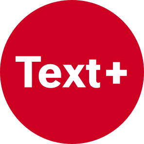

The _DigiMusTh_ project focuses on the digital collection and analysis of historical music theory texts, with a particular emphasis on the 19th-century debate on major-minor dualism. While large digital collections of music theory texts already exist in other languages—such as the Thesaurus Musicarum Latinarum (TML) and the Thesaurus Musicarum Italicarum (TMI)—there is currently no comparable collection for German-language texts, despite their central role in European music theory since the 18th century. _DigiMusTh_ aims to fill this gap by creating a sustainable and expandable digital edition that offers new perspectives for both musicology and the digital humanities.

A key aspect of the project is the integration of different types of texts. In addition to monographs and treatises, theoretical journal articles will also be included to provide a more comprehensive picture of the historical debate. Relevant periodicals, such as the Neue Zeitschrift für Musik, the Allgemeine Musikzeitung, and the Neue Berliner Musikzeitung, are already available in digital form. Since a complete collection is not feasible, a targeted selection will be made: only articles that are thematically linked to the existing corpus—either through shared authorship or direct references—will be included. This approach will offer a broader perspective on the discourse of the time and its dissemination in the public sphere.

Another goal is the technical and methodological advancement of digital music theory editing. The complex structure of the sources—including text, images, and musical elements—presents challenges that require innovative solutions. The continuous expansion of the collection will also contribute to the refinement of encoding guidelines and the development of music-theoretical ontologies. Additionally, the integration of individual research projects, such as master's theses or doctoral dissertations on relevant texts, is possible after review, allowing for a collaborative expansion of the collection.

In the long term, DigiMusTh aims to become an open, cooperatively expandable platform for historical music theory texts. Due to its interdisciplinary approach, the project is not only relevant to music theory and musicology but also to the digital humanities and the history of science, particularly concerning the physical and physiological foundations of harmonic theory. With its sustainable structure, DigiMusTh contributes to making historical music theory accessible and analyzable in modern digital formats.

Funded by [Text+](https://text-plus.org/en/), a consortium of the [National Research Data Infrastructure (NFDI)](https://www.dfg.de/de/foerderung/foerderinitiativen/nfdi).

